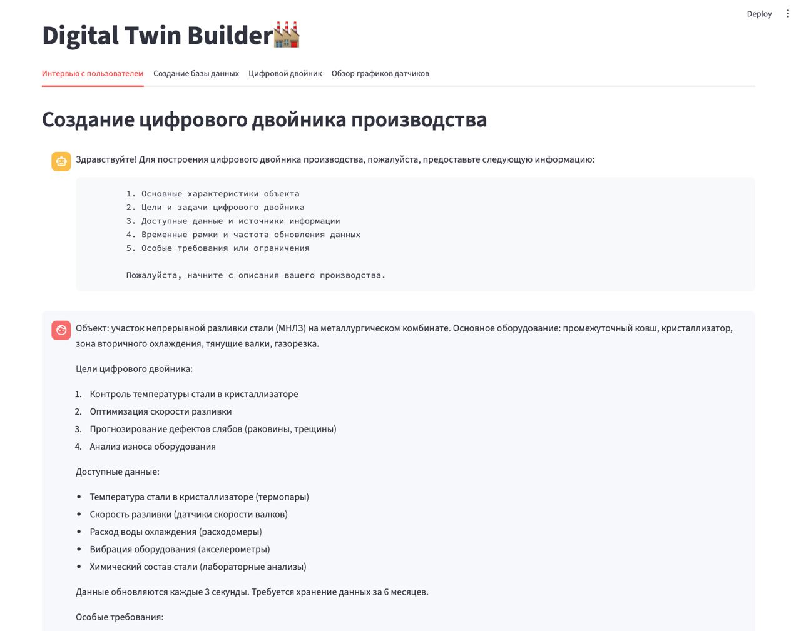
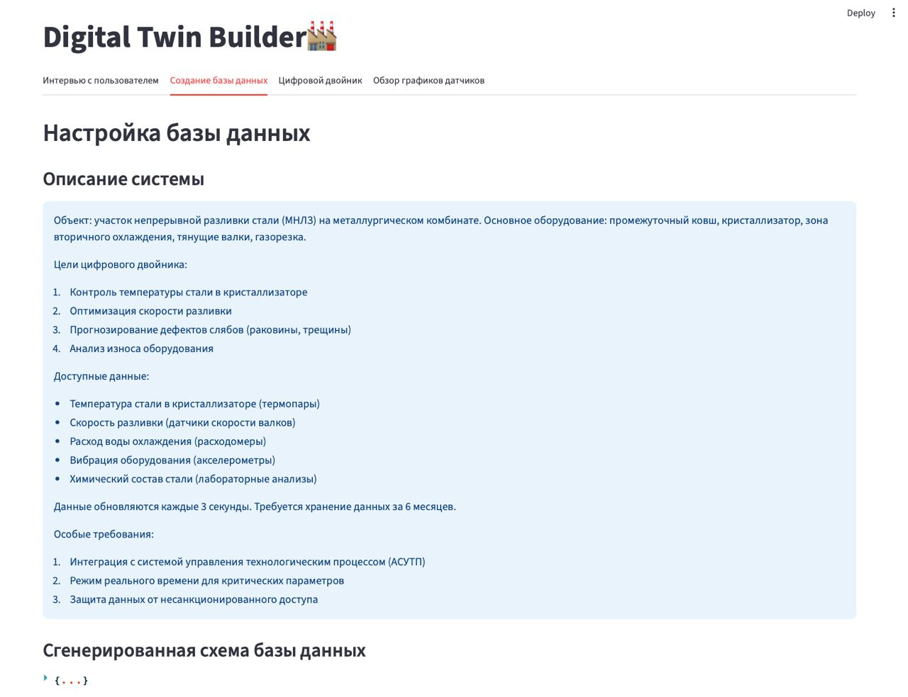
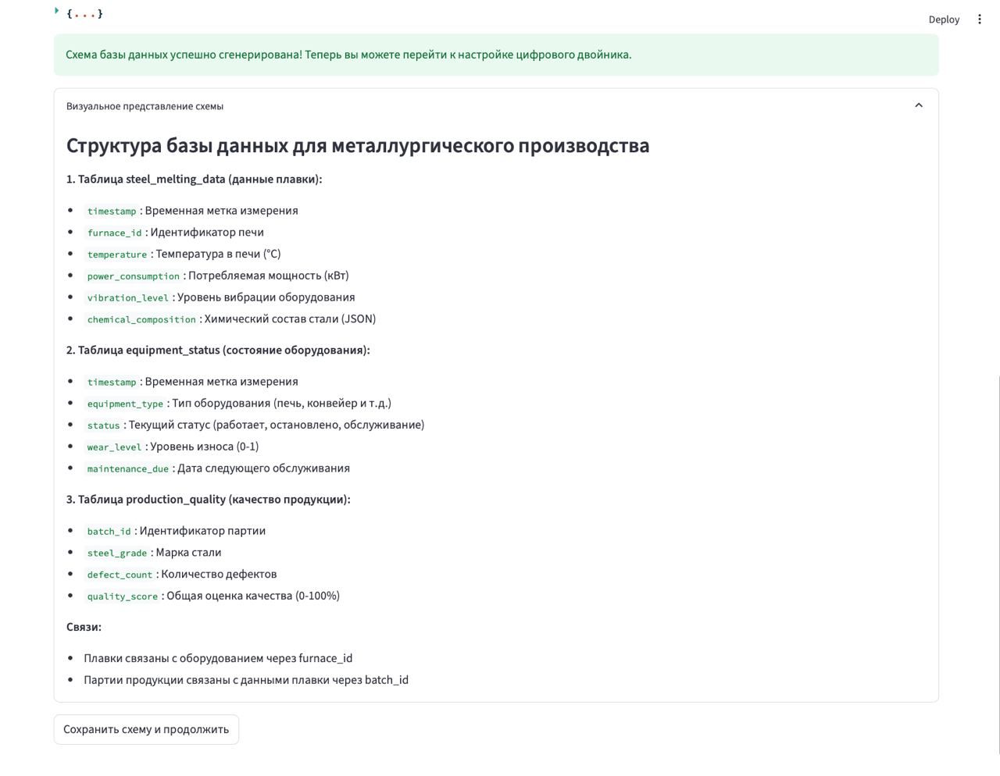
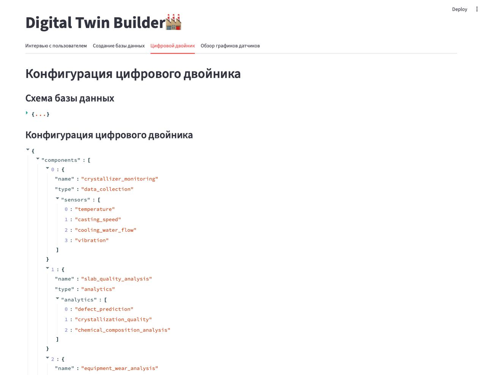
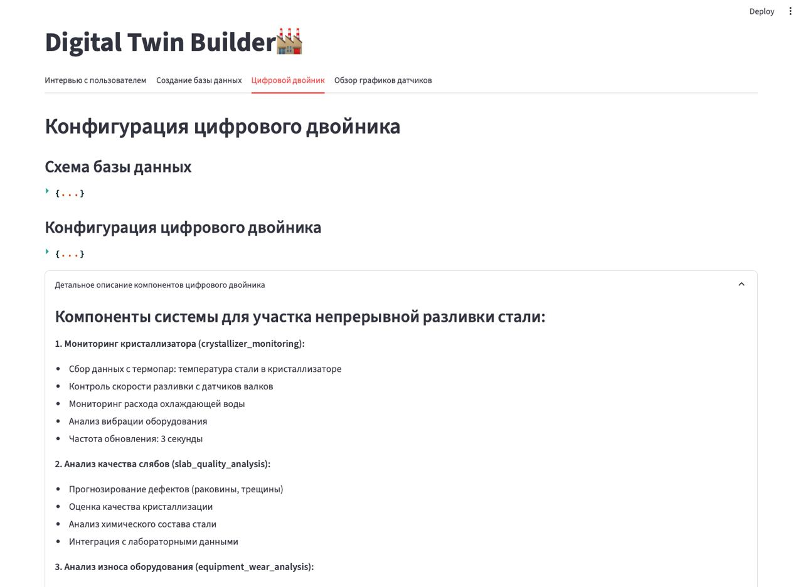
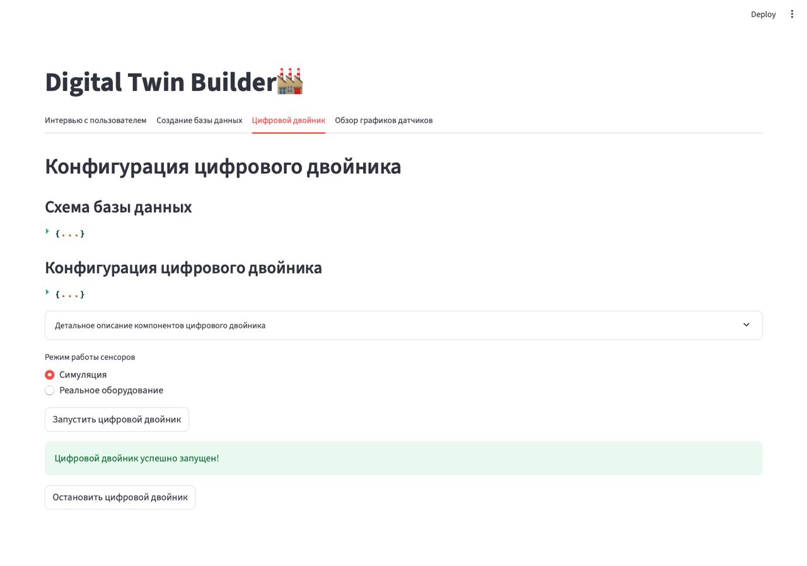
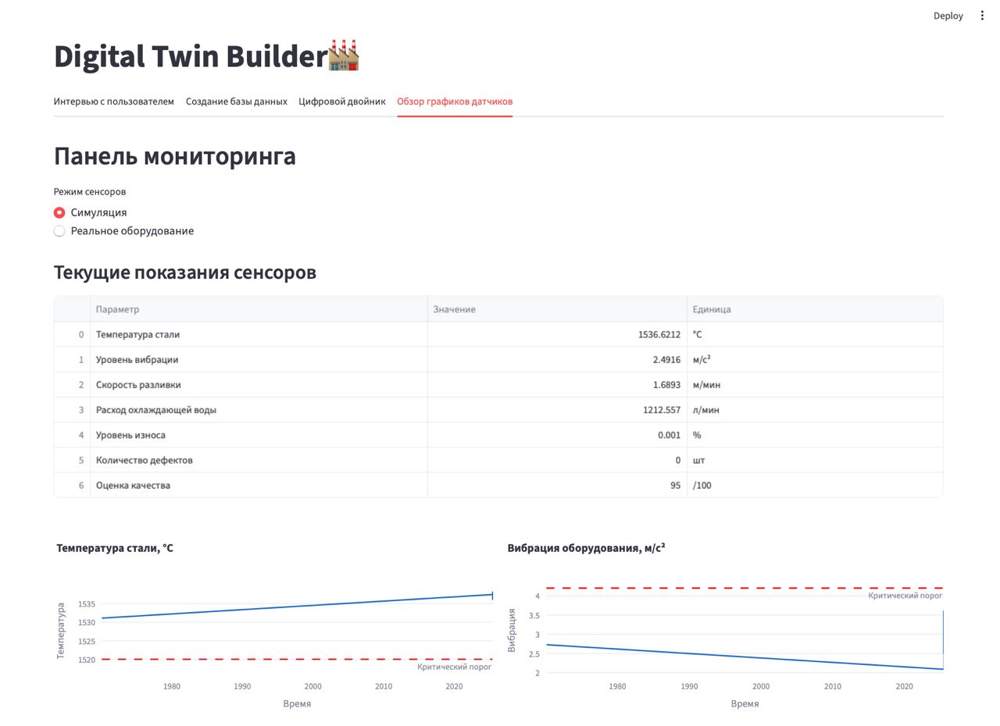
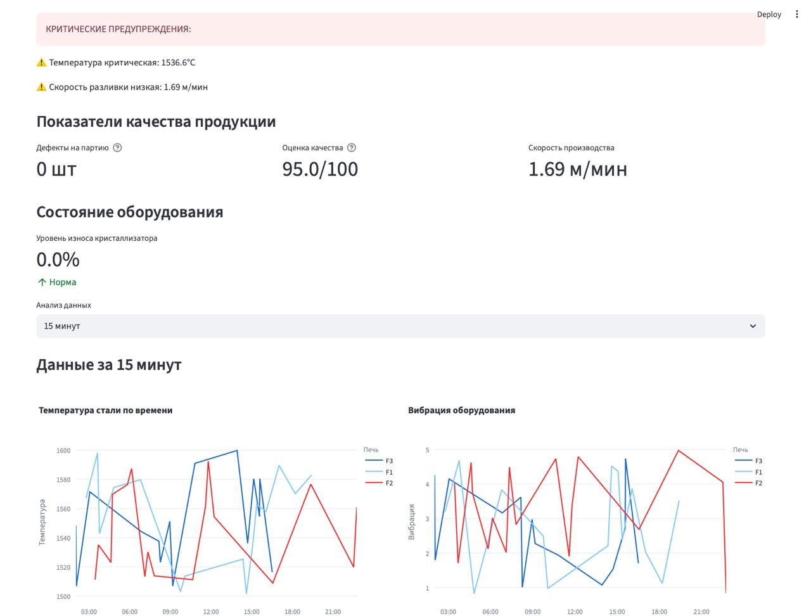
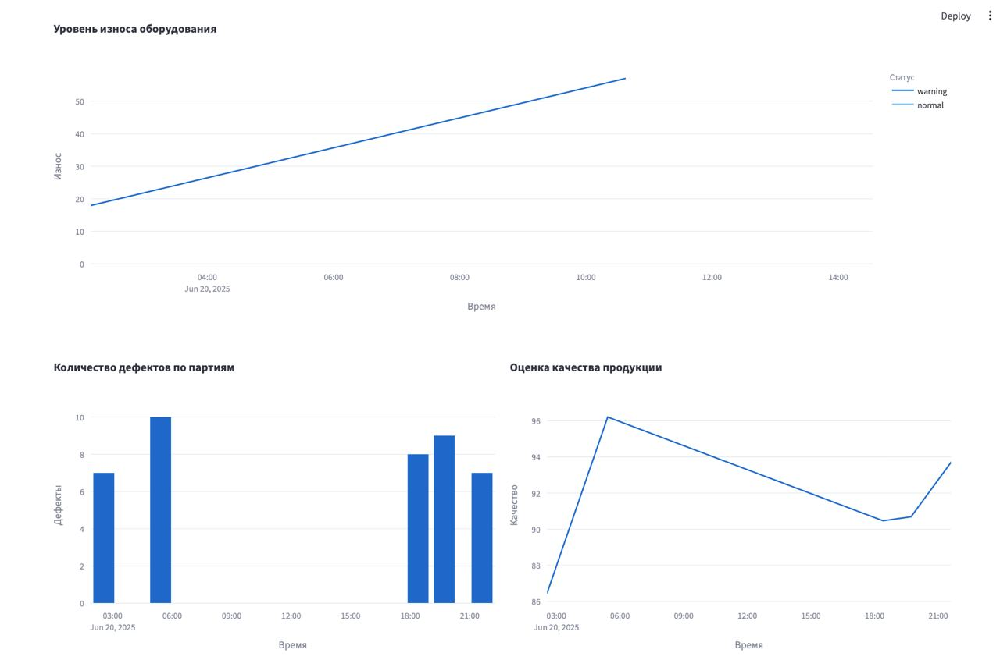

# DigitalTwinBuilder
## Автоматизированное построение цифрового двойника производства

В данном репозитории разрабатывается библиотека с открытым кодом, включающую мультиагентную систему, агенты которой проведут опрос работников завода, спроектируют и создадут базу данных для цифрового двойника, а также сконфигурируют цифрового двойника производства. Библиотека включает конструктор для построения цифрового двойника, а также панель мониторинга получаемых данных. Также в репозитории содержится библиотека для взаимодействия с камерами видеонаблюдения и датчиками.

Библиотека поддерживает получение сигнала со следующих датчиков:
* Температуры; 
* Уровня; 
* Вибрации; 
* Давления;
* Износа;
* [RFID](https://sauk.ru/).

Библиотека поддерживает следующие протоколы к ip камер видеонаблюдения для построения производства и дальнейшего анализа: 
* [Gige Vision](https://www.automate.org/vision/vision-standards/vision-standards-gige-vision) - интерфейс передачи данных для цифровых камер промышленного класса
* [RTSP](https://datatracker.ietf.org/doc/html/rfc7826) - протокол для организации трансляций и передачи медиаконтента

## Структура проекта

```
DigitalTwinBuilder/
├── src/
│   └── DigitalTwinBuilder/ 
│       ├── DTlibrary/ - модуль для работы с мультиагентной системой
│       │   ├── agents/
│       │   │   ├── __init__.py
│       │   │   ├── base_agent.py
│       │   │   ├── user_interaction_agent.py
│       │   │   ├── database_agent.py
│       │   │   └── digital_twin_agent.py
│       │   │   
│       │   ├── core/
│       │   │   ├── __init__.py
│       │   │   ├── database.py
│       │   │   ├── models.py
│       │   │   └── sensor_manager.py
│       │   │   
│       │   ├── sensors/
│       │   │   ├── __init__.py
│       │   │   ├── base_sensor.py
│       │   │   ├── level_sensor.py
│       │   │   ├── pressure_sensor.py
│       │   │   ├── rfid_sensor.py
│       │   │   ├── temperature_sensor.py
│       │   │   ├── vibration_sensor.py
│       │   │   └── wear_sensor.py
│       │   │ 
│       │   ├── main.py   
│       │   ├── web_interface.py   
│       │   └── requirements.txt 
│       │   
│       └── ipcamera/ - модуль для работы с камерами с использованием протоколов gige vision и rtsp
│           ├── cpp/
│           │   ├── src/
│           │   │   └── camera/
│           │   │       ├── client.cpp
│           │   │       ├── client.hpp
│           │   │       ├── CMakeLists.txt
│           │   │       ├── gige
│           │   │           └── ...
│           │   │       └── rtsp
│           │   │           └── ...
│           │   │
│           │   ├── bindings/
│           │   │   └── camera/
│           │   │       ├── bindings.cpp
│           │   │       ├── CMakeLists.txt
│           │   │       ├── gige
│           │   │           └── ...
│           │   │       └── rtsp
│           │   │           └── ...
│           │   │
│           │   ├── python/
│           │   │   └── ipcamera/
│           │   │       ├── __init__.py
│           │   │       └── camera/
│           │   │           ├── __init__.py
│           │   │           ├── camera.so
│           │   │           ├── gige
│           │   │           |   └── ...
│           │   │           └── rtsp
│           │   │               └── ...
│           │   │
│           │   └── CMakeLists.txt
│           ├── __init__.py   
│           └── _core.so 
├── main.py 
├── scripts/
├── tests/
├── pyproject.toml
├── requirements.txt
└── README.md
```
## Установка
```bash
git pull https://github.com/CTLab-ITMO/DigitalTwinBuilder && cd DigitalTwinBuilder
```
### Docker (рекомендованный путь)
#### Установка зависимостей
##### Ubuntu, Debian
```bash
sudo apt-get update
sudo apt-get install docker docker-compose-plugin
```
##### Fedora, CentOS
```bash 
sudo yum update
sudo yum install docker docker-compose-plugin
```
##### MacOS
```bash
brew install docker docker-compose
```
Также в зависимости от настроек вашей системы вам может понадобиться выполнить некоторые шаги, которые напишет brew при установке
#### Настройка Docker
```bash
docker compose up -d
```
Перезапуск
```bash
docker compose up --build -d && docker compose restart
```
### Cборка из источника
#### Установка зависимостей
##### Ubuntu
```bash
sudo dnf install gcc cmake vcpkg boost-devel
```
#### IP camera module
```bash
mkdir -p build
rm -rf build/*
cmake -DCMAKE_TOOLCHAIN_FILE=$VCPKG_ROOT -DBOOST_ROOT=$BOOST_ROOT --preset Debug -S .
cmake --build ./build
```
## Использование
```bash
python main.py 
```
### IP camera модуль
```python
from digital_twin_builder.ipcamera.camera.gige import gige
camera_ip = "192.168.150.15"
my_ip = "192.168.1.94"
streaming_port = 53899 ## should be the one that used in docker
g = gige(camera_ip, my_ip, streaming_port)
g.start_stream()
print("Enter :q to quit")
answer = ""
while (answer != ":q"):
    answer = input()
g.stop_stream()

from digital_twin_builder.ipcamera.camera.gige.gvcp import gvcp
gc = gvcp(camera_ip)
ack = gc.discovery
print(ack.current_ip) # "192.168.150.15"
```
### DTlibrary
```bash
streamlit run web_interfaces.py
```

















## License

This project is licensed under the MIT License - see the [LICENSE](https://github.com/lizaelisaveta/DigitalTwinOfProduction/blob/main/LICENSE) file for details.
