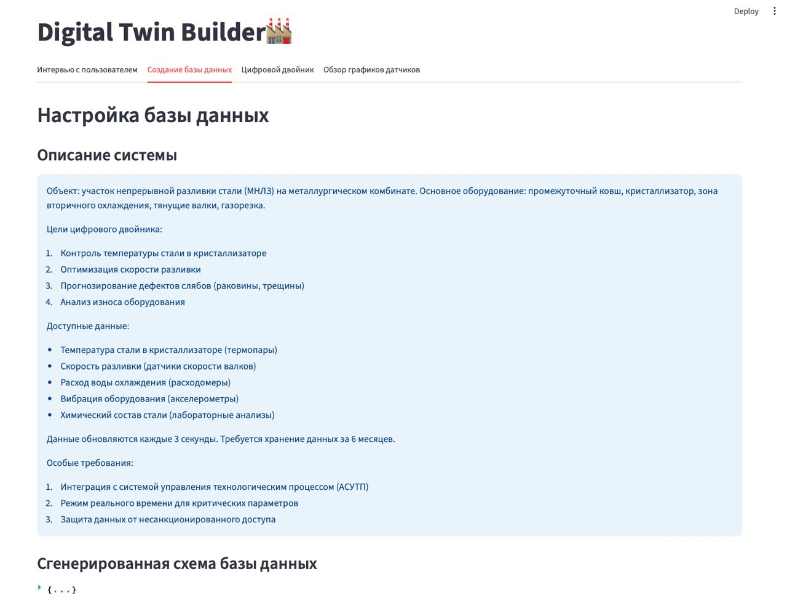
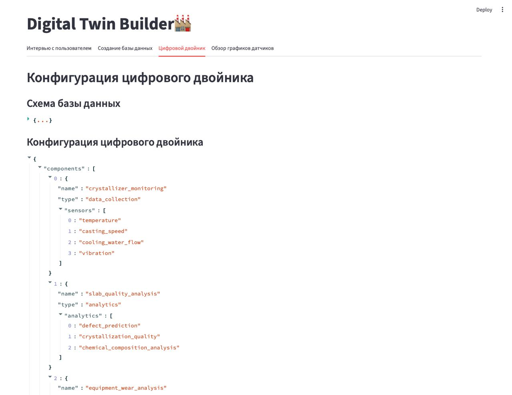
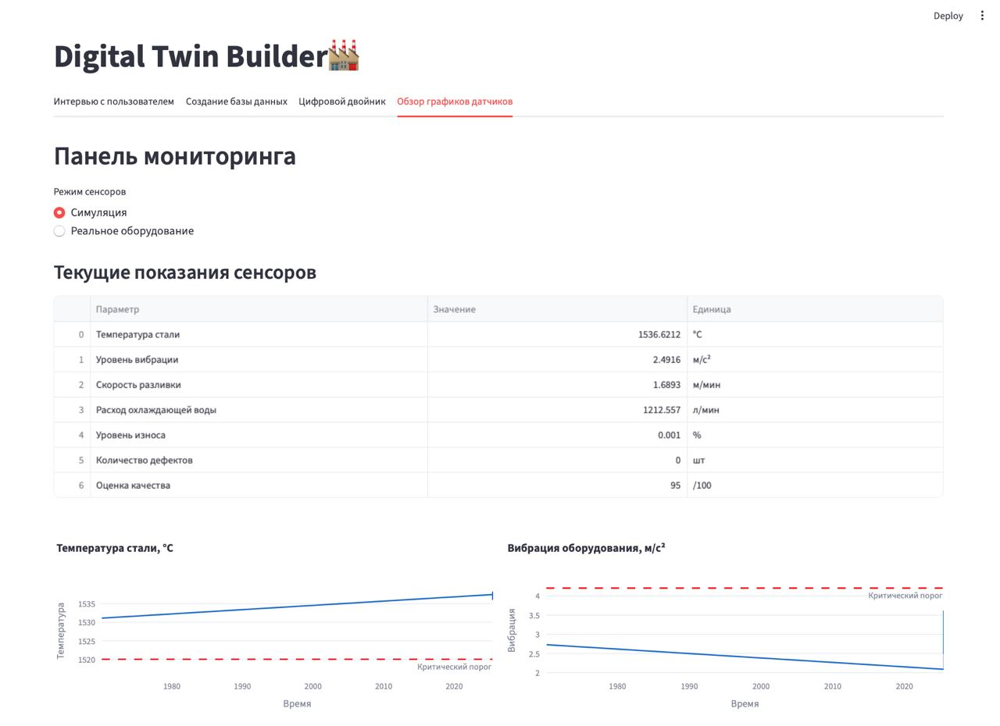
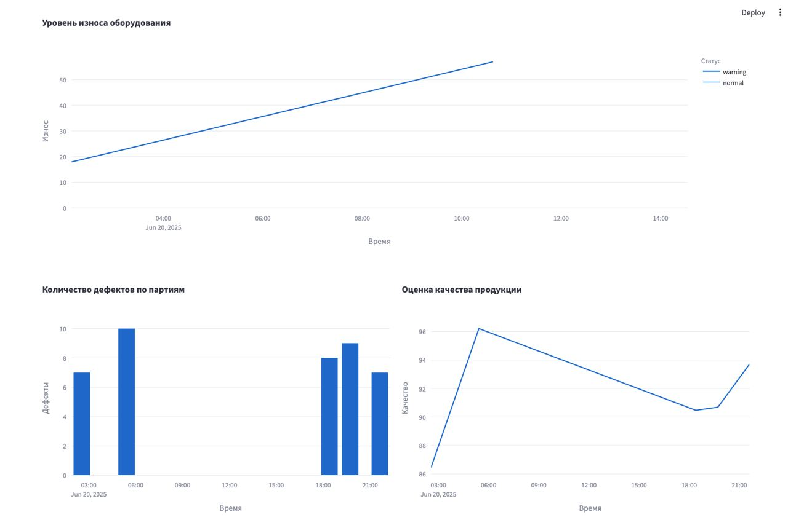

# DigitalTwinBuilder
## Automated building of a digital twin of production

In this repository, an open source library is being developed to create digital twin of productions. It is based on a multi-agent system that collects data, designs a database, and configures a digital twin. It contains a digital twin constructor and a data monitoring panel. This also includes tools for integration with video surveillance cameras and sensors.

The library supports receiving a signal from sensors:
* Temperature.
* Level.
* Vibrations.
* Pressure.
* Wear and tear.
* [RFID](https://sauk.ru/).

The library supports protocols for IP video surveillance cameras for building production and further analysis: 
* [Gige Vision](https://www.automate.org/vision/vision-standards/vision-standards-gige-vision ) is a data transfer interface for industrial-grade digital cameras.
* [RTSP](https://datatracker.ietf.org/doc/html/rfc7826 ) is a protocol for organizing broadcasts and transmitting media content.

## Project structure

```
DigitalTwinBuilder/
├── src/
│   └── DigitalTwinBuilder/ 
│       ├── DTlibrary/ - a module for working with a multi-agent system
│       │   ├── agents/
│       │   │   ├── __init__.py
│       │   │   ├── base_agent.py
│       │   │   ├── user_interaction_agent.py
│       │   │   ├── database_agent.py
│       │   │   └── digital_twin_agent.py
│       │   │   
│       │   ├── core/
│       │   │   ├── __init__.py
│       │   │   ├── database.py
│       │   │   ├── models.py
│       │   │   └── sensor_manager.py
│       │   │   
│       │   ├── sensors/
│       │   │   ├── __init__.py
│       │   │   ├── base_sensor.py
│       │   │   ├── level_sensor.py
│       │   │   ├── pressure_sensor.py
│       │   │   ├── rfid_sensor.py
│       │   │   ├── temperature_sensor.py
│       │   │   ├── vibration_sensor.py
│       │   │   └── wear_sensor.py
│       │   │ 
│       │   ├── main.py   
│       │   ├── web_interface.py   
│       │   └── requirements.txt 
│       │   
│       └── ipcamera/ - a module for working with cameras using the gige vision and RTSP protocols
│           ├── cpp/
│           │   ├── src/
│           │   │   └── camera/
│           │   │       ├── client.cpp
│           │   │       ├── client.hpp
│           │   │       ├── CMakeLists.txt
│           │   │       ├── gige
│           │   │           └── ...
│           │   │       └── rtsp
│           │   │           └── ...
│           │   │
│           │   ├── bindings/
│           │   │   └── camera/
│           │   │       ├── bindings.cpp
│           │   │       ├── CMakeLists.txt
│           │   │       ├── gige
│           │   │           └── ...
│           │   │       └── rtsp
│           │   │           └── ...
│           │   │
│           │   ├── python/
│           │   │   └── ipcamera/
│           │   │       ├── __init__.py
│           │   │       └── camera/
│           │   │           ├── __init__.py
│           │   │           ├── camera.so
│           │   │           ├── gige
│           │   │           |   └── ...
│           │   │           └── rtsp
│           │   │               └── ...
│           │   │
│           │   └── CMakeLists.txt
│           ├── __init__.py   
│           └── _core.so 
├── main.py 
├── scripts/
├── tests/
├── pyproject.toml
├── requirements.txt
└── README.md
```
## Installation
```bash
git pull https://github.com/CTLab-ITMO/DigitalTwinBuilder && cd DigitalTwinBuilder
```
### Docker (recommended)
#### Installing dependencies
##### Ubuntu, Debian
```bash
sudo apt-get update
sudo apt-get install docker docker-compose-plugin
```
##### Fedora, CentOS
```bash 
sudo yum update
sudo yum install docker docker-compose-plugin
```
##### MacOS
```bash
brew install docker docker-compose
```
Depending on your system settings, you may need to follow some of the steps that brew will write during installation.
#### Configuring Docker
```bash
docker compose up -d
```
#### Restart
```bash
docker compose up --build -d && docker compose restart
```
### Build from the source
#### Installing dependencies
##### Ubuntu
```bash
sudo dnf install gcc cmake vcpkg boost-devel
```
#### IP camera module
```bash
mkdir -p build
rm -rf build/*
cmake -DCMAKE_TOOLCHAIN_FILE=$VCPKG_ROOT -DBOOST_ROOT=$BOOST_ROOT --preset Debug -S .
cmake --build ./build
```
## Using
```bash
python main.py 
```
### IP camera module
```python
from digital_twin_builder.ipcamera.camera.gige import gige
camera_ip = "192.168.150.15"
my_ip = "192.168.1.94"
streaming_port = 53899 ## should be the one that used in docker
g = gige(camera_ip, my_ip, streaming_port)
g.start_stream()
print("Enter :q to quit")
answer = ""
while (answer != ":q"):
    answer = input()
g.stop_stream()

from digital_twin_builder.ipcamera.camera.gige.gvcp import gvcp
gc = gvcp(camera_ip)
ack = gc.discovery
print(ack.current_ip) # "192.168.150.15"
```
### DTlibrary
```bash
streamlit run web_interfaces.py
```
An interview with an employee takes place via a chat dialog on the "User Interview" page.


The next step is to "Create a database" based on the information received from the user.


In order to provide a better perception, a text version of the agent's work result is provided.


At the next stage, the "Digital Twin" agent configures the digital twin, selecting the necessary components.


To ensure a better perception, a text version of the agent's work result is provided.


Before starting the digital twin, it is necessary to select the operating mode of the sensors. Simulated data was selected to test this example. Appropriate buttons are provided for starting and stopping the sensor.


After launching the digital twin, the Dashboard becomes active to review the simulation results and sensor data. This example shows the current sensor readings, graphs of changes in indicators, warnings about critical values, some quality indicators, as well as an analysis of historical data presented by various graphs.



## License

This project is licensed under the MIT License - see the [LICENSE](https://github.com/lizaelisaveta/DigitalTwinOfProduction/blob/main/LICENSE) file for details.
